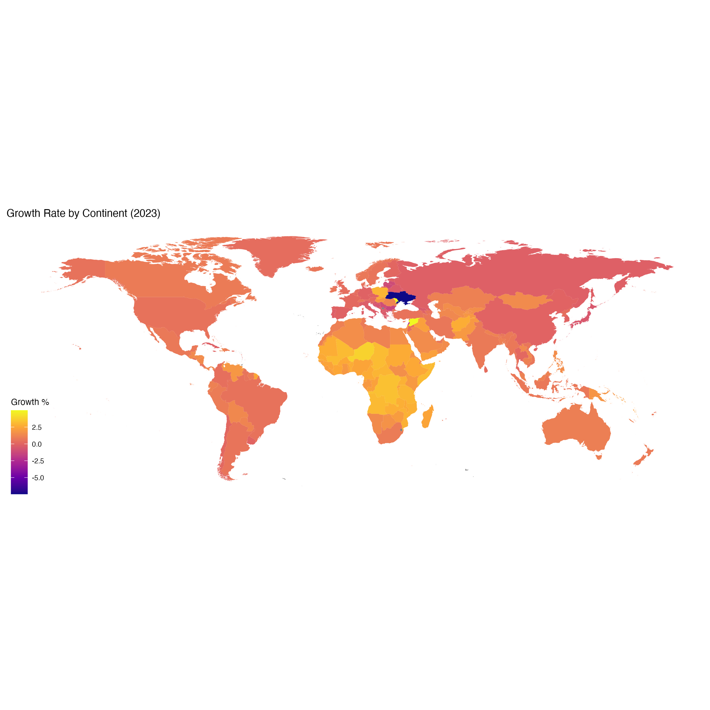

# Exploring World Population With R
In this project, I explore and analyze a world population dataset in the R programming language. Utilizing dplyr, tidyverse, and ggplot2, I created two choropleth maps with one map showing the growth rate by continent; the other showing the growth rate of countries in Africa.

## Context

The world's population has undergone remarkable growth, exceeding 7.5 billion by mid-2019 and continuing to surge beyond previous estimates. Notably, China and India stand as the two most populous countries, with China's population potentially facing a decline while India's trajectory hints at surpassing it by 2030. This significant demographic shift is just one facet of a global landscape where countries like the United States, Indonesia, Brazil, Nigeria, and others, each with populations surpassing 100 million, play pivotal roles.

The steady decrease in growth rates, though, is reshaping projections. While the world's population is expected to exceed 8 billion by 2030, growth will notably decelerate compared to previous decades. Specific countries like India, Nigeria, and several African nations will notably contribute to this growth, potentially doubling their populations before rates plateau.

Can you tell which countries in Africa have the highest growth?

## Content

This dataset provides comprehensive historical population data for countries and territories globally, offering insights into various parameters such as area size, continent, population growth rates, rankings, and world population percentages. Spanning from 1970 to 2023, it includes population figures for different years, enabling a detailed examination of demographic trends and changes over time.

## Dataset

Structured with meticulous detail, this dataset offers a wide array of information in a format conducive to analysis and exploration. Featuring parameters like population by year, country rankings, geographical details, and growth rates, it serves as a valuable resource for researchers, policymakers, and analysts. Additionally, the inclusion of growth rates and world population percentages provides a nuanced understanding of how countries contribute to global demographic shifts.

This dataset is invaluable for those interested in understanding historical population trends, predicting future demographic patterns, and conducting in-depth analyses to inform policies across various sectors such as economics, urban planning, public health, and more.

## Structure

This dataset (world_population_data.csv) covering from 1970 up to 2023 includes the following columns:

| Column | Description |
|--------|-------------|
| `Rank` | Rank by Population |
| `CCA3` | 3 Digit Country/Territories Code |
| `Country` | Name of the Country|
| `Continent` | Name of the Continent|
| `population_2023` | Population of the Country in the year 2023 |
| `population_2022` | Population of the Country in the year 2022 |
| `population_2020` | Population of the Country in the year 2020 |
| `population_2015` | Population of the Country in the year 2015 |
| `population_2010` | Population of the Country in the year 2010 |
| `population_2000` | Population of the Country in the year 2000 |
| `population_1990` | Population of the Country in the year 1990 |
| `population_1980` | Population of the Country in the year 1980 |
| `population_1970` | Population of the Country in the year 1970 |
| `area_kms_squared` | Area size of the Country/Territories in square kilometer |
| `density_kms_squared` | Population Density per square kilometer |
| `growth_rate` | Population Growth Rate by Country |
| `world_percentage` | Population percentage by each Country |

## Acknowledgements

Thanks to [@sazidthe1](https://github.com/sazidthe1) who provided the dataset to [Kaggle](https://www.kaggle.com/datasets/sazidthe1/world-population-data/data).

